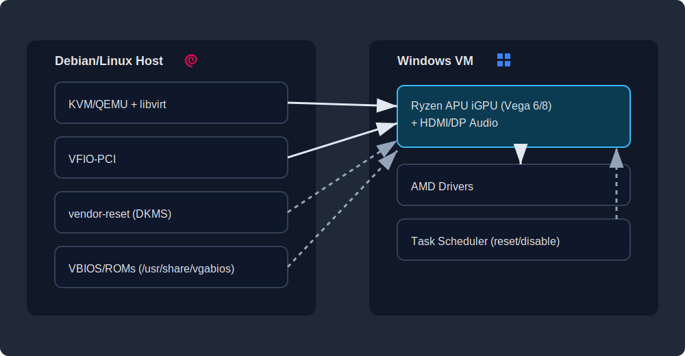

# Ryzen APU iGPU Passthrough (Renoir / Cezanne)

Practical KVM/QEMU guide for Vega 6/8 with stable reset workflows.

This repository documents a practical approach to get **Ryzen APU Vega iGPU passthrough** running on **KVM/QEMU**.

Primary target / confirmed focus:
- ✅ **Ryzen 4000G series (Renoir, iGPU 0x1636)**
- ✅ **Ryzen 5000G series (Cezanne, iGPU 0x1638)**

It may also work for other APUs or even some discrete GPUs (dGPUs) — **but no guarantees**.  
Your exact combo of **hardware + BIOS + kernel + drivers** decides everything.

---
Note: This was rock-solid for me on Debian 12 + kernel 6.12.12
On Debian 13 + newest kernel 6.12.57 or even 6.16 or 6.17 no chance

NEW FINDINGS:
I had a working version before I upgraded to Debian 13 on 10. January 2026
Since then my VM crashed when I started a Game or even When I tried to login physically on the Monitor

- libvirt, qemu, ovmf downgrade: so far no change
- kernel downgrade to 6.12.12 also no change
- removed firmware-amd-graphics completely
- downgrade Windows Treiber to 25.8.1: This has fixed a login crash!

Result: so far still crashes under Load...

## Architecture (high-level)

bash

---

## Why this exists

I did not find any complete working guide out there.
So I built one.

Ryzen APU iGPU passthrough often fails with:
- black screen
- **Error 43**
- reset issues after VM shutdown
- “works once” behavior

This repo documents a setup that is meant to be **repeatable**, not luck.

---

## What this repo contains

### VBIOS / ROM files
- `vbios_1636.dat` — Renoir Vega 6 (e.g. 4350G)
- `vbios_1638.dat` — Cezanne Vega 8 (e.g. 5700G)
- `ATIAudioDevice_AA01.rom` — HDMI/DP audio ROM (works for both)

> **IMPORTANT:** You must include the **audio device** in passthrough — otherwise this commonly ends in **Error 43**.

### Windows helper scripts
- `manage-gpu.bat` — enable/disable/reset GPU + AUDIO device
- `swap-gpu.*` — optional GPU ↔ VirtIO/VNC swap

### vendor-reset scripts
- `install_vendor-reset_module.sh` - contains the necessary commands to first remove the dkms vendor-reset module and then install it again

---

## Quick TL;DR (8 steps)

1. Enable **SVM + IOMMU** in BIOS (UEFI recommended)
2. Install **vendor-reset** via DKMS and add your iGPU ID (`0x1636` Renoir / `0x1638` Cezanne) in `src/device-db.h`
3. (Debian 12/13 + kernel 6.12) if DKMS fails, patch `src/amd/amdgpu/atom.c` include
4. Put VBIOS/ROM files into `/usr/share/vgabios`  
   - `vbios_1636.dat` or `vbios_1638.dat`  
   - `ATIAudioDevice_AA01.rom`
5. Add **both** PCI functions to your VM XML: iGPU **and** iGPU audio, and attach the ROM files
6. Use **UEFI + Secure Boot (OVMF)** and recommended Hyper-V/KVM feature flags
7. Boot Windows → install AMD drivers
8. Activate Windows Side reset

> **Full step-by-step guide is below.**

---

## Want the result without debugging? (Paid help)

This repo is free and open and contains everything you need to build a working setup.

But let’s be honest: **Ryzen APU iGPU passthrough can eat entire weekends**.

If you’re reading this and thinking:

> “Nice… but I don’t want to spend 6+ hours testing random changes until it finally works.”

Then you can **hire me** for a **paid, done-with-you setup** (remote / guided troubleshooting).

### What I can help you with
✅ black screen / no output  
✅ **Error 43** (and the usual audio-ROM trap)  
✅ vendor-reset patch + DKMS build issues  
✅ correct libvirt XML for **GPU + HDMI/DP audio**  
✅ ROM/VBIOS handling (`/usr/share/vgabios` etc.)  
✅ getting **stable start/stop/reboot behavior**  
✅ making it repeatable (Windows Task Scheduler automation)

### What this is (and what it isn’t)
- This is **paid support**, not a free helpdesk
- We agree on **scope + pricing upfront**
- You keep full control of your system — I guide you, explain, and fix the chain with you
- VFIO/iGPU passthrough depends on the right combination of mainboard, gpu, kernel. So this is **best-effort paid troubleshooting**, not a “100% guaranteed fix”. 
- If your hardware/software combo looks unrealistic, I’ll tell you early.

### What to send me (so I can tell you quickly if it’s doable)
- APU model (e.g. **4350G / 5600G / 5700G**)  
- Host OS (Debian / Proxmox / Ubuntu)
- Kernel version (So far only 6.12 works with vendor-reset)
- Your symptom (**Error 43** / black screen / only first boot works)

---

# Full step-by-step guide

# Ryzen APU Vega iGPU Passthrough (Renoir / Cezanne) — Step-by-step Guide

This repo documents a **working** approach to run an AMD **Ryzen APU Vega iGPU** as a **passthrough GPU** for a Windows VM (KVM/QEMU/libvirt).

## Hardware scope

### ✅ Confirmed / intended support
- **Ryzen 4000G series (Renoir, iGPU `0x1636`)**
- **Ryzen 5000G series (Cezanne, iGPU `0x1638`)**

### ⚠️ Might work on other hardware (no guarantees)
Other APUs (and even some dGPUs) *might* work too, but results depend on your exact combo of **hardware + BIOS + kernel + driver**.

## ⚠️ Software scope
- vendor-reset currently only works until Kernel 6.12
---

## Best way (what finally made it reliable)

1) Add the iGPU to **vendor-reset** (`gnif/vendor-reset`) by adding your device ID to `src/device-db.h` under `AMD_NAVI10`, e.g.:
- Renoir: `{PCI_VENDOR_ID_ATI, 0x1636, op, DEVICE_INFO(AMD_NAVI10)}, \`
- Cezanne: `{PCI_VENDOR_ID_ATI, 0x1638, op, DEVICE_INFO(AMD_NAVI10)}, \`

2) Use a Windows **manage-gpu** script + Task Scheduler to **reset the GPU on startup** and **disable it on shutdown**.

---

# Step-by-step Instructions

These steps are based on (and aligned with) the Proxmox forum discussion here:
- https://forum.proxmox.com/threads/amd-ryzen-5600g-igpu-code-43-error.138665/

## 1) Install and patch vendor-reset (Debian)

### 1.1 Clone vendor-reset
- https://github.com/gnif/vendor-reset

```bash
git clone https://github.com/gnif/vendor-reset
cd vendor-reset
```

### 1.2 Find your iGPU device ID
```bash
lspci -nkk
```

Renoir is typically `1636`, Cezanne is typically `1638`.

### 1.3 Add your APU iGPU to `src/device-db.h` in the vendor_reset folder
Edit: `src/device-db.h`

Find the `AMD_NAVI10` block and add your entry (example includes Renoir):

```c
#define _AMD_NAVI10(op) \
    {PCI_VENDOR_ID_ATI, 0x1636, op, DEVICE_INFO(AMD_NAVI10)}, \
    {PCI_VENDOR_ID_ATI, 0x7310, op, DEVICE_INFO(AMD_NAVI10)}, \
    {PCI_VENDOR_ID_ATI, 0x7312, op, DEVICE_INFO(AMD_NAVI10)}, \
```

For Cezanne add:
```c
{PCI_VENDOR_ID_ATI, 0x1638, op, DEVICE_INFO(AMD_NAVI10)}, \
```

### 1.4 Install with DKMS

easiest way:
- copy the install_vendor-reset_module.sh into the vendor-reset folder
- chmod +x install_vendor-reset_module.sh 
- ./install_vendor-reset_module.sh 

### 1.5 Debian 12 + kernel 6.12 build fix (needed in my case)
If DKMS fails on Debian 12 with kernel 6.12, I had to patch:

- Edit: `src/amd/amdgpu/atom.c`
- Change:
```c
#include <asm/unaligned.h>
```
to:
```c
#include <linux/unaligned.h>
```

Then run the instal-script again

./install_vendor-reset_module.sh 

### 1.6 Load the module at boot
Note: the module name is `vendor_reset` (underscore, not dash).

Add it to `/etc/modules`:
```text
vendor_reset
```

Reboot.

---

## 2) IOMMU and GRUB

### 2.1 IOMMU groups
My mainboard had the GPU already in a separate IOMMU group.

If yours is not, you may need ACS override / IOMMU separation (google your exact platform + “ACS override”).

### 2.2 GRUB options
On my system no further GRUB options were necessary because my host is a **headless Debian 12 server** (OMV installed) and it seems to disable the iGPU automatically.

(Your setup may differ.)

---

## 3) VBIOS / ROM files

### 3.1 Extract your VBIOS and HDMI audio ROM
You can extract these from:
- your GPU / system firmware
- or from a UEFI/BIOS update file

If you have the same CPUs as me (4350G or 5700G), you can use the files in this repo:
- `vbios_1636.dat` — Vega 6 (4350G)
- `vbios_1638.dat` — Vega 8 (5700G)
- `ATIAudioDevice_AA01.rom` — HDMI audio device (works for both)

> **IMPORTANT:** You must include the **audio device** otherwise passthrough often ends as **Error 43**.

### 3.2 My extraction method (BIOS update file)
I used:
- UBU tool: https://winraid.level1techs.com/t/tool-guide-news-uefi-bios-updater-ubu/3035 (UBU-1.80)
- Extract the archive, run `UBU.cmd`, provide the UEFI update file when prompted.

Then convert as described here:
- https://github.com/isc30/ryzen-gpu-passthrough-proxmox?tab=readme-ov-file#configuring-the-gpu-in-the-windows-vm
- https://github.com/isc30/ryzen-gpu-passthrough-proxmox/discussions/18#discussioncomment-8627679

### 3.3 Put ROM files where libvirt can load them (Debian)
Add the VBIOS/ROM files to:
```bash
sudo mkdir -p /usr/share/vgabios
sudo cp vbios_1636.dat vbios_1638.dat ATIAudioDevice_AA01.rom /usr/share/vgabios/
```

On Debian, this path was required for me (other locations did not work).

---

## 4) Add the PCIe devices to your VM (libvirt domain.xml)

### 4.1 Add GPU + Audio hostdev entries
Edit your VM XML (`virsh edit <vmname>` or virt-manager → XML) and add BOTH devices.

Example (adjust bus/slot/function to your system):

```xml
<hostdev mode="subsystem" type="pci" managed="yes">
  <source>
    <address domain="0x0000" bus="0x06" slot="0x00" function="0x0"/>
  </source>
  <rom file="/usr/share/vgabios/vbios_1636.dat"/>
  <address type="pci" domain="0x0000" bus="0x06" slot="0x00" function="0x0"/>
</hostdev>

<hostdev mode="subsystem" type="pci" managed="yes">
  <driver name="vfio"/>
  <source>
    <address domain="0x0000" bus="0x06" slot="0x00" function="0x1"/>
  </source>
  <rom file="/usr/share/vgabios/ATIAudioDevice_AA01.rom"/>
  <address type="pci" domain="0x0000" bus="0x09" slot="0x00" function="0x0"/>
</hostdev>
```

---

## 5) VM firmware + Windows compatibility options

### 5.1 UEFI + Secure Boot (required)
UEFI is necessary. For Win11, virt-manager usually configures this automatically.

Example:
```xml
<os firmware='efi'>
  <type arch='x86_64' machine='pc-q35-10.0'>hvm</type>
  <firmware>
    <feature enabled='yes' name='enrolled-keys'/>
    <feature enabled='yes' name='secure-boot'/>
  </firmware>
  <loader readonly='yes' secure='yes' type='pflash' format='raw'>/usr/share/OVMF/OVMF_CODE_4M.ms.fd</loader>
  <nvram template='/usr/share/OVMF/OVMF_VARS_4M.ms.fd' templateFormat='raw' format='raw'>/var/lib/libvirt/qemu/nvram/Win11_VARS.fd</nvram>
  <bootmenu enable='no'/>
</os>
```

### 5.2 Hyper-V / KVM feature flags (I left them enabled)
I enabled a bunch of options. I’m not sure which ones are strictly necessary, but I did not want to keep testing once it worked:

```xml
<features>
  <acpi/>
  <apic/>
  <hyperv mode='custom'>
    <relaxed state='on'/>
    <vapic state='on'/>
    <spinlocks state='on' retries='8191'/>
    <vpindex state='on'/>
    <synic state='on'/>
    <stimer state='on'/>
    <reset state='on'/>
    <vendor_id state='on' value='1756857dhai7'/>
    <frequencies state='on'/>
    <reenlightenment state='on'/>
    <tlbflush state='on'/>
    <ipi state='on'/>
  </hyperv>
  <kvm>
    <hidden state='on'/>
  </kvm>
  <vmport state='off'/>
  <smm state='on'/>
  <ioapic driver='qemu'/>
</features>
```

---

## 6) Boot Windows + install AMD drivers

Boot the VM into Windows and install AMD drivers.
For me the **official AMD drivers** worked (manual download). Automatic detection may work too.

---

## 7) Optional but sometimes required: Windows reset/disable automation

This was required on my **5700G**.  
My **4350G** worked without it.

I created `manage-gpu.bat` which can **enable/disable/reset** both the GPU and the AUDIO device in Device Manager.

### 7.1 Get the device instance paths
In Windows Device Manager:
- open the GPU device → **Details** → **Device instance path**
- do the same for the AUDIO device

Example:
`PCI\\VEN_1002&DEV_1638&SUBSYS_D0001458&REV_C8\\4&3B1E1872&0&000D`

You can omit the tail after the second backslash:
- use: `PCI\\VEN_1002&DEV_1638&SUBSYS_D0001458&REV_C8`
Set these values as `GPU_ID` and `AUDIO_ID` in the script.

### 7.2 Import scheduled tasks
1) Import `Archive/disable_gpu.xml` and `Archive/reset_gpu.xml` in Task Scheduler
2) Save / enable the tasks

---

## Keywords

Ryzen APU, iGPU passthrough, Vega 6, Vega 8, Renoir, Cezanne, KVM, QEMU, libvirt, VFIO, vendor-reset, Error 43, Windows VM, VBIOS, ROM, OVMF, IOMMU, DKMS.

---

## Celebrate 🎉

You successfully implemented a working APU iGPU passthrough setup — which many say is impossible.

---

## Did not work (for me)

A qemu hook with just:
`/sys/bus/pci/devices/0000:06:00.0/remove 2>/dev/null`

`vendor_reset` is doing more than that.

---
